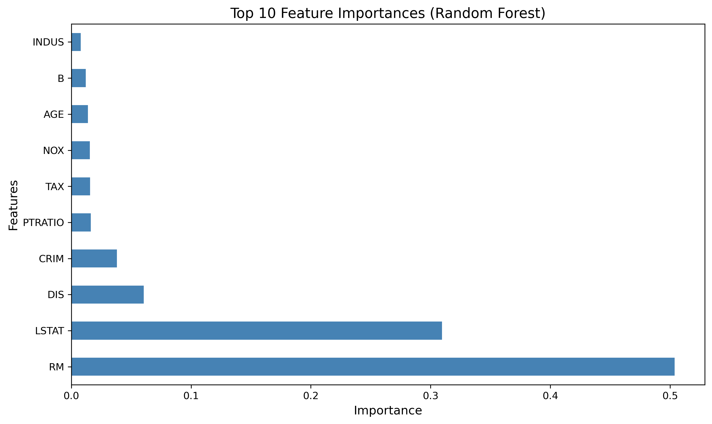
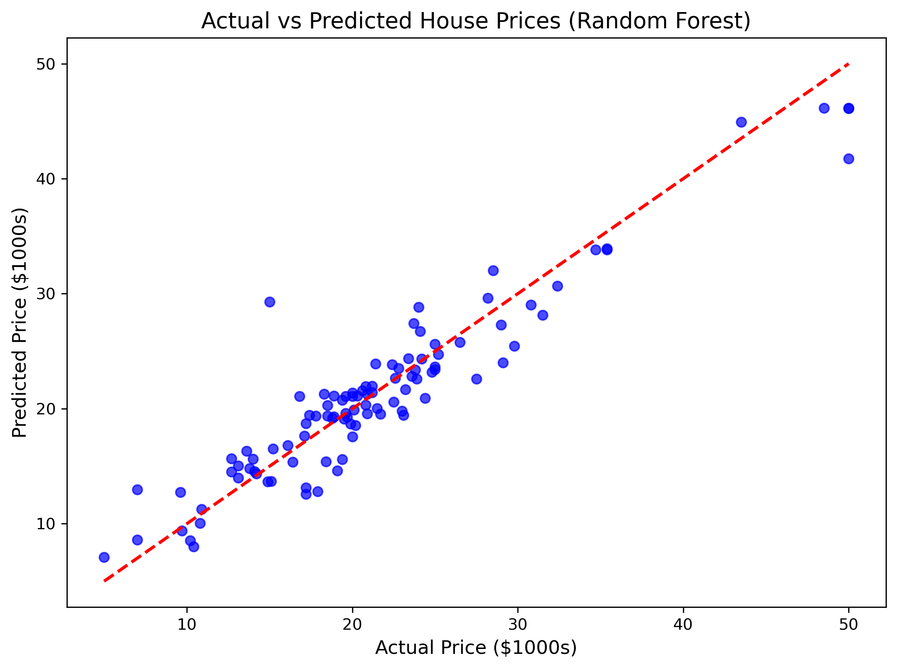

# 🏠 House Price Prediction using Regression

A machine learning project completed during my **Data Analytics Internship at Codveda**, predicting median house prices in Boston using regression models.

# Requirements

* pandas==2.1.0
* numpy==1.25.0
* matplotlib==3.7.2
* seaborn==0.12.2
* scikit-learn==1.3.0
* jupyter==1.0.0

---

## 🎯 Objective
Predict house prices (`MEDV`) based on 13 features like crime rate, average rooms, accessibility to highways, and more—using real-world housing data.

---

## 📊 Dataset
- **Source**: [Boston Housing Dataset](https://www.kaggle.com/c/boston-housing) (renamed as `house Prediction Data Set.csv`)
- **Features**: 13 predictive variables (e.g., `RM`, `LSTAT`, `DIS`)
- **Target**: `MEDV` — Median value of owner-occupied homes (in $1000s)
- **Rows**: 506

---

## 🛠️ Tools & Libraries
- Python
- `pandas`, `numpy` — Data manipulation
- `matplotlib`, `seaborn` — Visualization
- `scikit-learn` — Modeling & evaluation
- Jupyter Notebook

---

## 🔍 Key Steps
1. **Data Loading & Cleaning**  
   - Loaded whitespace-delimited CSV
   - Verified no missing values or duplicates

2. **Exploratory Data Analysis (EDA)**  
   - Analyzed distributions and correlations
   - Identified strong predictors: `LSTAT` (% lower status), `RM` (avg. rooms)

3. **Modeling**  
   - Trained **Linear Regression** and **Random Forest Regressor**
   - Evaluated using **R²**, **RMSE**

4. **Insights & Visualization**  
   - Plotted actual vs. predicted prices
   - Showcased top feature importances

---

## 📈 Model Performance

| Model               | R² Score | RMSE    |
|---------------------|----------|---------|
| Linear Regression   | ~0.74    | ~4.7    |
| Random Forest       | **~0.92**| **~2.8**|

> ✅ Random Forest significantly outperforms linear regression, capturing non-linear relationships.

---

## 📸 Sample Visualizations

### Feature Importance (Top 5)

### Actual vs Predicted Prices

---

## 💡 Key Insights
- **Neighborhood income level** (`LSTAT`) is the strongest negative predictor.
- **More rooms** (`RM`) strongly correlate with higher prices.
- Distance to employment centers (`DIS`) also plays a meaningful role.

---
